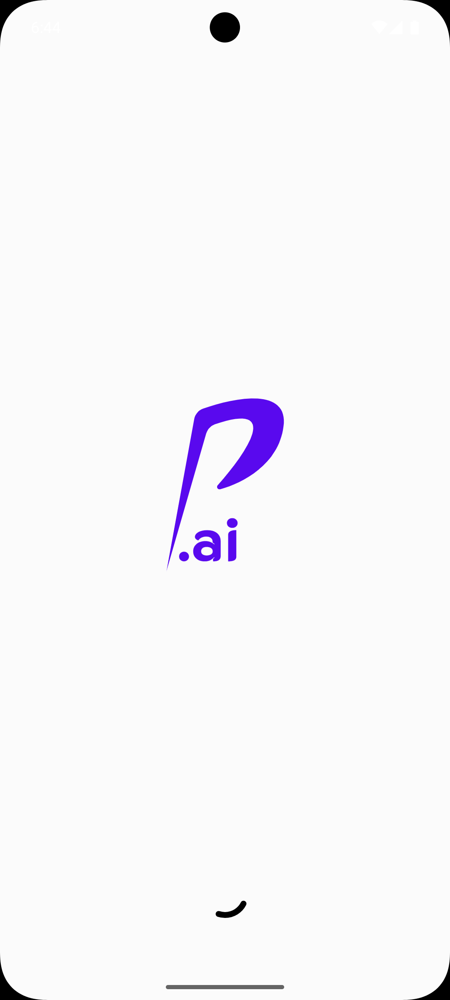
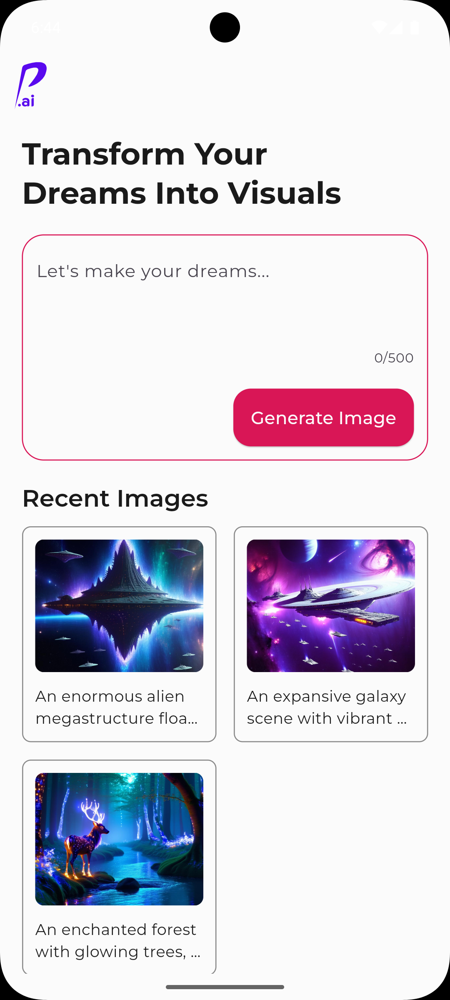
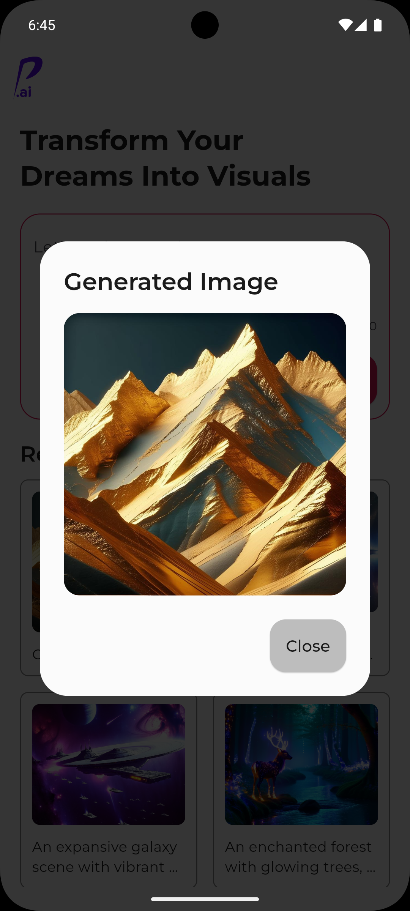
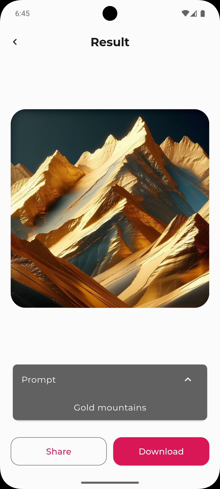

# Penta AI

Penta AI is a Flutter application that uses the [Hugging Face API](https://huggingface.co/) to generate images from text. The application uses the [`stabilityai/stable-diffusion-3.5-large`](https://huggingface.co/stabilityai/stable-diffusion-3.5-large#stable-diffusion-35-large) model to generate images from text. The generated images can be saved to the Firebase Firestore according to the device ID.

## Setup

#### Clone the repository

```bash
git clone https://github.com/ANILSRGT/flutter_penta_ai.git
```

#### Install dependencies

```bash
flutter pub get
```

#### [Firebase](https://console.firebase.google.com/) setup

1.  Create a new project in Firebase
2.  Add an Android app to the project with FirebaseCLI

#### [Hugging Face](https://huggingface.co/) setup

1.  Create a new account in Hugging Face
2.  Create a new access token:
    - Check the `Make calls to the serverless Inference API` option in the `Inference` section
    - Select the `stabilityai/stable-diffusion-3.5-large` model in the `Repositories permissions` section
    - Already checked the `Read access to contents of selected repos` option in the `Repositories permissions` section. If not, check it.
3.  Add values in `.env` file:

```bash
STABILITY_DIFFUSION_3_5_LARGE_API_URL = "https://api-inference.huggingface.co/models/facebook/stability-diffusion-3-5-large"
STABILITY_DIFFUSION_3_5_LARGE_API_TOKEN = "YOUR_API_TOKEN"
```

#### Run the app

```bash
flutter run
```

## Features

- [✔️] Text to Image

## Screen Shots

<div align="center">
  
  
  
  
</div>
